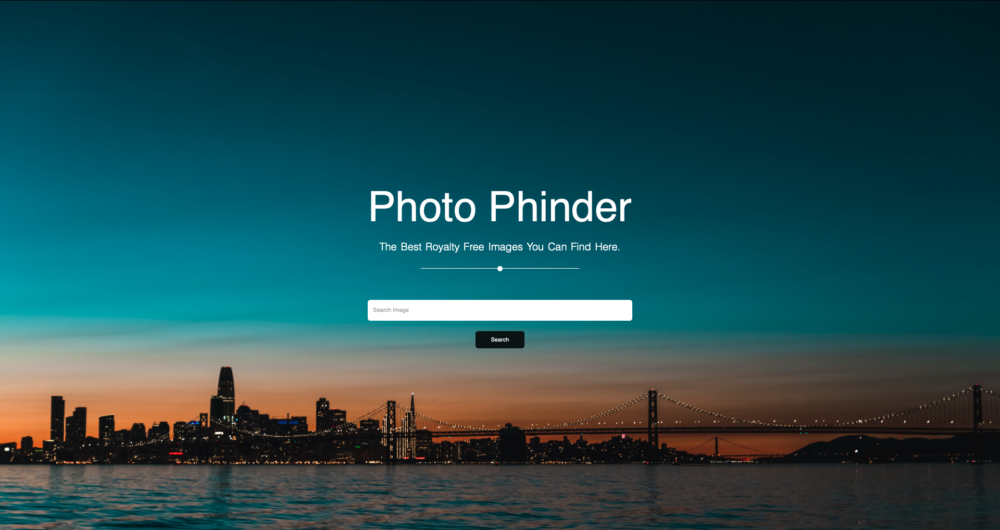
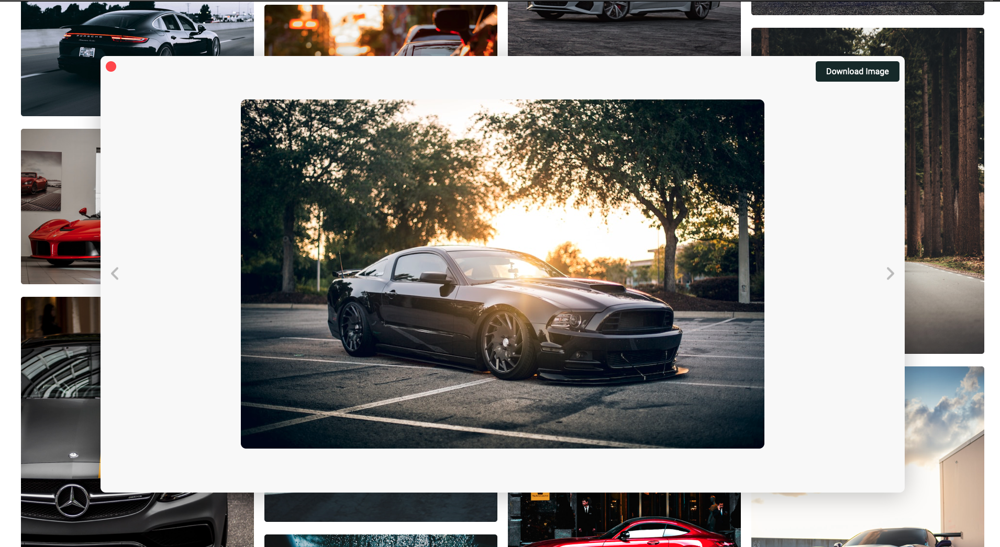

# Foto Findr

Foto Findr is photo search webapp made in Javascript which uses Unsplash JSON APIs for photo search. A clone app of  [https://unsplash.com](https://unsplash.com/) the most powerful photo engine in the world. Trying to make the unplash like UI  and add functionality as much as possible. 
## Completed UI screenshots

## Key Usages 
- Access the unsplash API by  [registering as a developer](https://unsplash.com/developers).
- Before using the Unsplash API, read the API Guidelines. Specifically you must:
   - [hotlink images](https://help.unsplash.com/api-guidelines/more-on-each-guideline/guideline-hotlinking-images)
   - [attribute photographers](https://help.unsplash.com/en/articles/2511315-guideline-attribution)
   - [trigger a download when appropriate](https://help.unsplash.com/en/articles/2511258-guideline-triggering-a-download)

## Contribution

The devlopement of the App is still in progress. Only some part is implemented. You can help with 
code contribution to add more functionality in the App.

## Important 

[Unplash](https://unsplash.com) is a registered trademark. This project is just for learning purposes and should be treated as such.